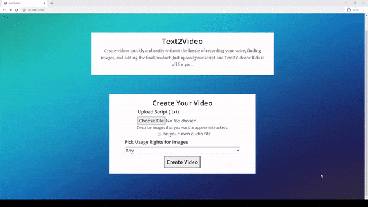

# Text2Video

Text2Video's purpose is to help people create videos quickly and easily by simply typing out the video’s script and a description of images to include in the video.



## Usage

Just upload a script and an optional audio file of you saying the script<br>
To start the server run this in the terminal

`docker-compose --env-file ./.env.dev up -d`

Go to `localhost:3001` to view the website

If the command above doesn't work run
`docker-compose build --no-cache`

For instructions on how to use Text2Video check out this [tutorial](https://www.youtube.com/watch?v=o5VlCaXgN6w).

## Installation

Run these commands

```
git clone https://github.com/joshchen984/Text2Video.git
cd Text2Video
mkdir app/static/videos
mkdir tmp
```

## Requirements

Python 3.6 or up

Docker
[How to install](https://www.youtube.com/watch?v=5nX8U8Fz5S0)

## Development

- Uses [rq](https://python-rq.org/) to manage background jobs
- Can't pass in files to background jobs

## Deployment

- Deployed on digitalocean
- Domain managed by cloudflare

## Acknowledgments

This was inspired by Carykh's [Youtube Video Creator](https://www.youtube.com/watch?v=Jr9sptoLvJU&t=64s).
